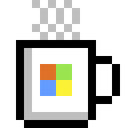

# Weekly Pixel Art Challenge

Learn #PixelArt by doing weekly challenges! Tag your tweet with #LearnPixelArt. We'll start a new challenge every Friday!

There won't be any judging or ranking, it's just for fun, so we can inspire each another and learn together.

## How to participate

1. Follow [@learnpixelart](https://twitter.com/learnpixelart) on Twitter and check the new challenge post every Friday.
2. Create pixel art that fulfills the challenge criteria, using any medium you like; it can be digital 💻, paper 📄 (check out the [grid paper templates](grid-paper)), or cross-stitching 🧵!
3. Upload the digital work, or a picture of the physical work to Twitter and use the #LearnPixelArt hashtag.
4. [Find out](https://twitter.com/search?q=%23learnpixelart) what others have created and give it some ❤. That's it!

## Examples

|  | Luise | Marc | Maxime |
| - | - | - | - |
| **Challenge 1** |   *WALL-E* |  *Laptop* |  *Microsoft Mug* |

## Resources

* [Pixel art tutorials](https://lospec.com/articles/pixel-art-where-to-start/)

* [Tools you can use](https://lospec.com/pixel-art-software-list)

## Challenges

| # | Start | Challenge | Colors | Size
| - | - | - | - | -
| 1 | Apr 30 | What's on your desk | Up to 8 | 16x16
| 2 | May 7 | '90s tech | Up to 5 | 24x24
| 3 | May 14 | Toy(s) | Up to 16 | 24x24
| 4 | May 21 | - | - | -
| 5 | May 28 | - | - | -
| 6 | Jun 4 | - | - | -
| 7 | Jun 11 | - | - | -
| 8 | Jun 18 | - | - | -
| 9 | Jun 25 | - | - | -
| 10 | Jul 6 | - | - | -
