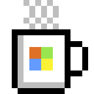

# Weekly Pixelart Challenge

This is the repository where we manage some stuff around [twitter.com/learnpixelart](https://twitter.com/learnpixelart).

Learn #PixelArt by doing weekly challenges! Tag your tweet with #LearnPixelArt. We'll start a new challenge every Friday!

## Examples

Here are some examples for the first challenge:

|  | By Luise | By Marc | By Maxime |
| - | - | - | - |
| **Week 1 examples** |   *WALL-E* |  *Laptop* |  *Microsoft Mug* |

## Challenges

| Week | Theme | Colors | Size
| - | - | - | -
| 1 | What's on your desk | Up to 8 | 16x16
| 2 | '90s tech | Up to 5 | 24x24
| 3 | - | - | -
| 4 | - | - | -
| 5 | - | - | -
| 6 | - | - | -
| 7 | - | - | -
| 8 | - | - | -
| 9 | - | - | -
| 10 | - | - | -
